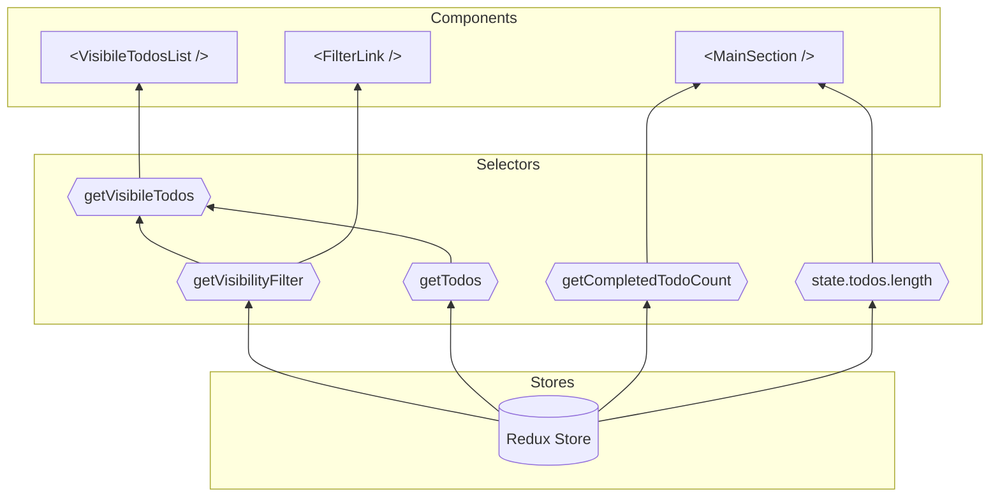
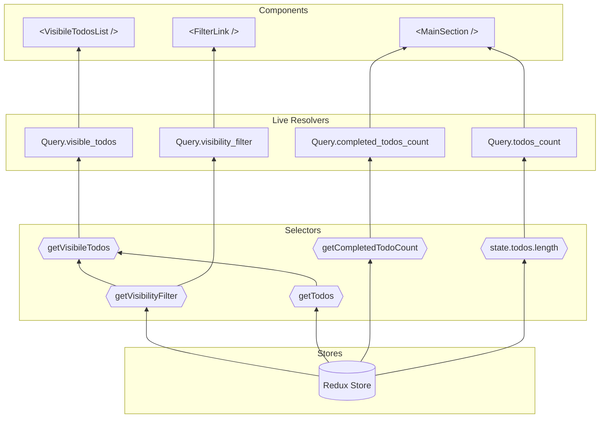
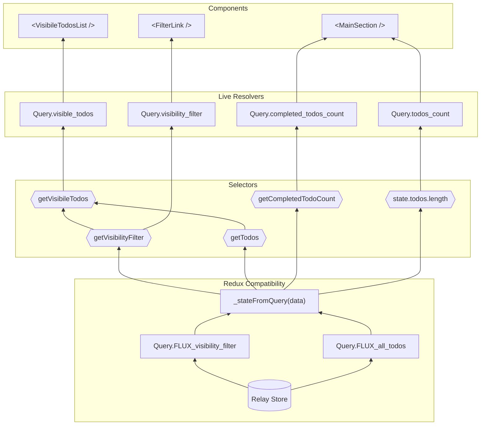
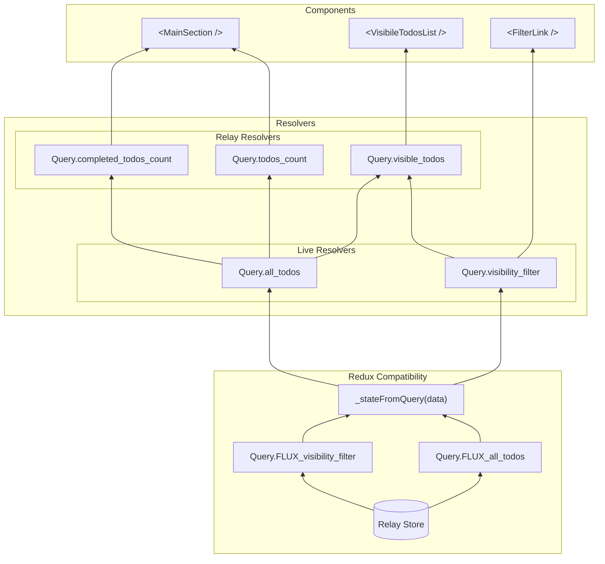
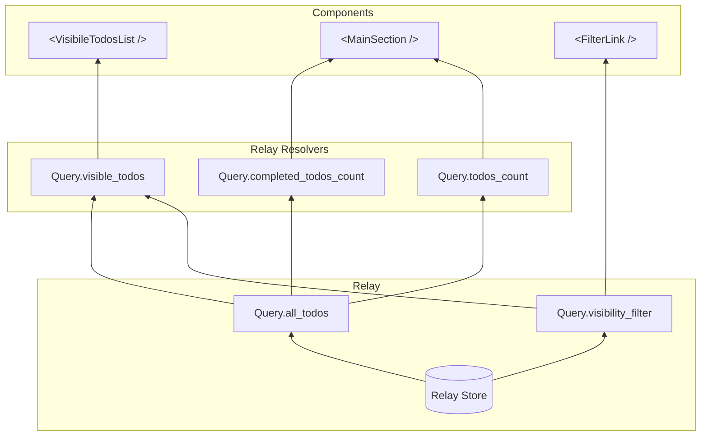

# Example: Migrating a Redux App to Relay using Live Resolvers

[Relay Resolvers](https://relay.dev/docs/next/guides/relay-resolvers/) are a feature in [Relay](https://relay.dev) which allows you to model derived state in your Relay GraphQL schema. Live Resolvers (currently undocumented) are an experimental variant of Relay Resolvers which allow you to expose non-Relay dynamic client state in your Relay GraphQL schema.

While useful on thier own, they can be combined to provide an incremental migration path from a legacy client data provider -- like Redux -- onto Relay.

In this repository we aim to migrate an [example Redux app](https://github.com/reduxjs/redux/tree/master/examples/todomvc) to Relay incrementally.

## Caveats

This example is a bit strained since it is only modeling client state. In most real apps you would have a combination of client and server state.

**This repository is an exporatory work in progress.**

# The Migration Steps

Below the proposed migration strategy is broken into discrete steps with diagrams showing how data flow works at each stage.

While this document and repository shows each step being completed in a single commit/step, in reality each step can be able to be split up into many incremental sub-steps where a single selector/component/resolver/action is migrated at a time.

## 0. Redux Only

[Browse the code at this point](https://github.com/captbaritone/redux-to-relay-with-live-resolvers-example/tree/step-0)

To set the stage, we'll begin with a diagram of how the app is originally structure using pure Redux:

## 1. Expose Redux selectors as Live Resolvers in the Relay GraphQL Schema

[Browse the code at this point](https://github.com/captbaritone/redux-to-relay-with-live-resolvers-example/tree/step-1)

First we schematize the Redux state, and it's derived selector state, in a GraphQL schema using Live Resolvers. that done, we can replace all instances of `mapStateToProps` with components locally declaring their data dependenceis via `useFragment` with a single `useLazyLoadQuery` at the application root.

At this point all components in the app are reading via Relay APIs.

> The source of truth for buiness logic is still the selectors. Legacy parts of the app could still confidently use selectors.

## 2. Move Redux state into Local Schema Extensions

[Browse the code at this point](https://github.com/captbaritone/redux-to-relay-with-live-resolvers-example/tree/step-2)

The concrete state stored in the Redux store can be moved into Relay using Relay's [Client Schema Extension](https://relay.dev/docs/guides/client-schema-extensions/). In this approach the public API of the Redux store (`.getState()`, `.dispatch(action)`, `.subscribe(callback)`) are left unchanged, but the implemenation moves from Redux to Relay.

This new class uses the Relay store as its source of truth. `Store.dispatch(action)` result in writing to the Relay store (and notifying all subscribers) and `Store.getState()` reads from the Relay Store and derives a backwards compatibile state object.

> While this document shows these steps as linear, this migration step can actually be taken on in parallel with step 1.

## 3. Move selector logic into Relay Resolvers

[Browse the code at this point](https://github.com/captbaritone/redux-to-relay-with-live-resolvers-example/tree/step-3)

Now that all calls to selectors have been replaced by GraphQL reads, selectors are now just an implementation detail of Relay Resolvers. We can now move that code directly into the Resolvers, disolving the selectors in the process. In the case of nested selectors, we read the inner selector value from Relay via the Resolver's root fragment.

> **Note** In this step the Redux Compatibility class is pure overhead, but I've included it as a discrete step for clarity.

## 4. Replace Live Resolvers and Redux Compatibility with direct reads into Relay

[Browse the code at this point](https://github.com/captbaritone/redux-to-relay-with-live-resolvers-example/tree/step-4)

Once the store implementation has moved to using the Relay store as its source of truth, Live Resolvers can bypass their subscriptions to the Redux store, and be replaced with direct reads into the Relay store.

At this point `react-redux` remains in the app purely as a mechanism for dispatching and handling actions. All state is read directly through Relay and local state updates are performed through Relay APIs.

An optional fifth step would be to move the action handlers into hooks which are used by the components which currently dispatch those actions.

> Note how this can be implemented exclusively by deleting live resolvers which simply exposed legacy Flux state, and updating the compatibility store.

# Using this Repo:

If you'd like to try this repo locally, see below:

## Available Scripts

In the project directory, you can run:

### `yarn start`

Runs the app in the development mode. 
Open [http://localhost:3000](http://localhost:3000) to view it in the browser.

The page will reload if you make edits. 
You will also see any lint errors in the console.

### `yarn build`

Builds the app for production to the `build` folder. 
It correctly bundles React in production mode and optimizes the build for the best performance.

The build is minified and the filenames include the hashes. 
Your app is ready to be deployed!

### `yarn relay`

This will run the Relay compiler. Use `yarn relay watch` to start the compiler in watch mode.
